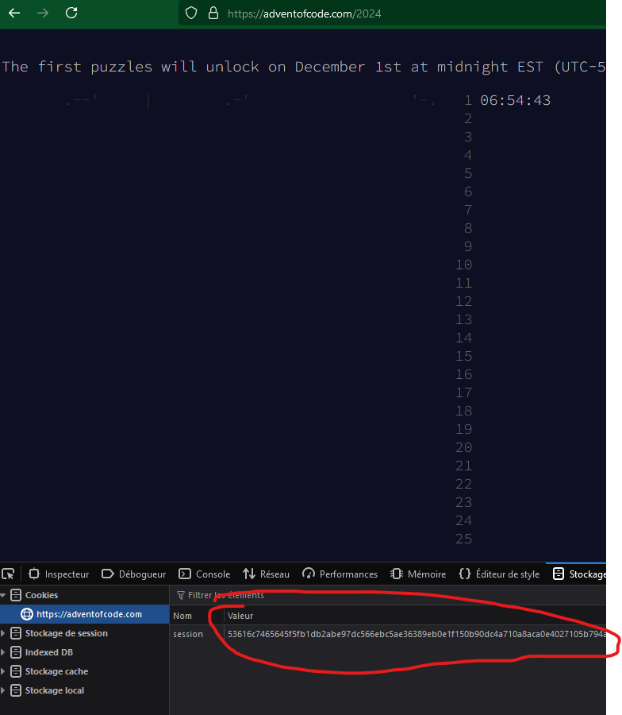

# Advent of Code

## Description

This repository contains my solutions for the Advent of Code.

## uv

[Download uv](https://docs.astral.sh/uv/getting-started/installation/) : 

```bash
# windows
powershell -ExecutionPolicy ByPass -c "irm https://astral.sh/uv/install.ps1 | iex"
```

Maybe you need to restart your computer after the installation.

## Installation

```bash
uv sync
```

## .env

You need to create a `.env` file in the root of the project with the following content:

```
AOC_COOKIE=
```

Copy cookie value from your browser (F12) and paste it in the `.env` file.


## Run

- Set the PYTHONPATH to the root of the project: `export PYTHONPATH=$(pwd)` (Not needed if you use my .vscode settings on VSCode or cursor)
- Use `from src.utils import main` in your file and run the code for a given day and part and your `code` function.
